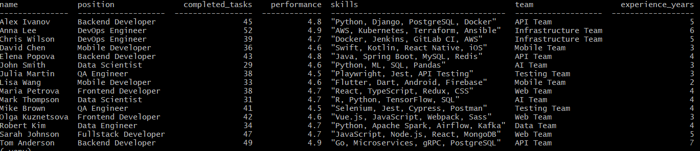
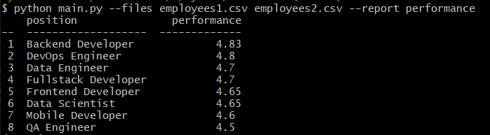

# Анализ эффективности работы разработчиков

Скрипт читает файлы с данными о закрыты задачах и формирует отчеты. Отчёт включает в себя список позицию и среднюю эффективность (среднее арифметическое по колонке performance), отчёт сортируются по эффективности. Название файлов (может быть несколько) и название отчета передается в виде параметров --files и --report. Отчёт формируется по всем переданных файлам. В случае если название отчета не указано - будет выведен полный список всех сотрудников

Пример использования без параметра:

Пример использования с параметром performance

## Добавление новых отчетов

В случае возникновения желания добавить новые отчеты нужно сделать следующее
1. В src/parsers в аргументе choices параметра --report добавить новый вид отчет
2. В src/collection добавить функционал отчета класса EmployeeCollection (если функционал с ним связан)
3. В src/reports добавить новый вид отчета (как и в пункте 1)

